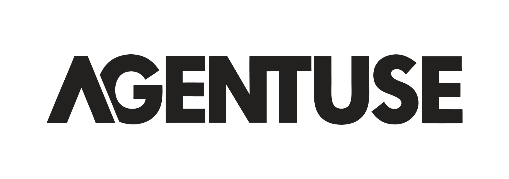

<picture>
  <source media="(prefers-color-scheme: dark)" srcset="./static/agentuse-logo-dark.png">
  <source media="(prefers-color-scheme: light)" srcset="./static/agentuse-logo.png">
  
</picture>

<h1 align="center">Autonomous Agents That Work Without You</h1>

<p align="center">
  <a href="https://www.npmjs.com/package/agentuse"></a>
  <a href="https://www.npmjs.com/package/agentuse"></a>
  <a href="https://github.com/agentuse/agentuse"></a>
  <a href="https://github.com/agentuse/agentuse/blob/main/LICENSE"></a>
</p>

<p align="center">
  <strong>Any model.</strong> Works with Claude, GPT, and open-source models.<br/>
  <strong>Run anywhere.</strong> Webhooks, built-in cron, approvals, CI/CD, Mac, Linux, Windows or Docker.<br/>
  <strong>No SDK required.</strong> Define your agent in Markdown.
</p>

<p align="center">
  <a href="#quick-start">Quick Start</a> •
  <a href="#example">Example</a> •
  <a href="#deploy">Deploy</a> •
  <a href="https://docs.agentuse.io">Documentation</a>
</p>

## Quick Start

```bash
# Try it now - no install needed
ANTHROPIC_API_KEY=sk-ant-... npx agentuse@latest run https://agentuse.io/hello.agentuse
```

Create `my-agent.agentuse`:

```markdown
---
model: anthropic:claude-sonnet-4-6
---

Generate a daily motivation quote with a tech fact.
Format as JSON with 'quote' and 'fact' fields.
```

Run it:

```bash
agentuse run my-agent.agentuse
```

## AI Coding Assistants

Install the AgentUse assistant skill:

```bash
npx skills add agentuse/agentuse
```

This installs a thin `agentuse` discovery stub for Claude Code, Codex, Cursor,
Gemini CLI, GitHub Copilot, Goose, OpenCode, Windsurf, and other assistants
that support Agent Skills. The stub loads current instructions from your
installed AgentUse CLI:

```bash
agentuse skills get core
```

For local development from this checkout:

```bash
npx skills add .
```

## Example

A real-world agent with MCP tools:

```yaml
---
model: anthropic:claude-sonnet-4-6
mcpServers:
  postgres:
    command: npx
    args: ["-y", "@modelcontextprotocol/server-postgres"]
    requiredEnvVars: [DATABASE_URL]
---

Query the sales table for yesterday's metrics.
Generate an executive summary with trends.
```

## Deploy

**Webhook Server** - Trigger agents via HTTP:
```bash
agentuse serve
curl -X POST http://localhost:12233/api/run -d '{"agent": "my-agent"}'

# Serve multiple projects from one process:
agentuse serve -C ./projA -C ./projB
curl -X POST http://localhost:12233/api/run -d '{"project":"projA","agent":"my-agent"}'
```

JSON endpoints live under the `/api/*` prefix (`/api`, `/api/agents`, `/api/schedules`, `/api/sessions`); the root and `/agents`, `/schedules`, `/sessions` paths serve a browser dashboard. `POST /run` and the other un-prefixed routes still work for backward compatibility but are deprecated.

**Global config** - put serve defaults in `~/.agentuse/config.json`:
```jsonc
{
  "serve": {
    "projects": [
      { "path": "~/work/projA" },
      { "id": "b", "path": "~/work/projB" }
    ],
    "default": "projA",
    "port": 12233,
    "host": "127.0.0.1",
    "auth": true,
    "logFile": true
  }
}
```
CLI flags override config. `-C` replaces `serve.projects`; `AGENTUSE_CONFIG=/path/to/config.json` uses another file. `AGENTUSE_API_KEY` remains env-only.

**Scheduled Agents** - Run on a schedule:
```yaml
---
schedule: "0 9 * * *"
---
```

**Approval Gates** - Pause before external side effects:
```yaml
---
model: anthropic:claude-sonnet-4-6
approval: true
channels:
  slack:
    events: [approval]
---
```

Open the dashboard at `http://127.0.0.1:12233/` and review a run on its session page (`/sessions/:id`), where pending gates can be approved, rejected, or continued. Approval gates, the web UI, and Slack channels are experimental in this pre-1.0 release.

## Features

### 🤖 Multi-Provider Support
Works with Anthropic (Claude), OpenAI (GPT), OpenRouter (open source models like GLM and Minimax), and Amazon Bedrock. Switch models with a single line change.

### 🌐 Webhooks & HTTP API
Trigger agents via HTTP webhooks. Integrate with Zapier, Make, GitHub Actions, or any system that can POST. Supports streaming responses for real-time output.

### ✅ Human Approval Gates
Pause an agent before publishing, sending, deploying, or changing external state. Reviewers can approve, reject, or comment from the web approval dashboard, with optional Slack notifications and threaded review context. Experimental while the API and channel configuration settle.

### ⏰ Cron Scheduling
Schedule agents to run automatically with built-in cron support. Use intervals for sub-daily (`5m`, `2h`) or cron expressions for daily+ (`0 9 * * *`).

### 📝 Markdown-Based Agents
Define agents as `.agentuse` files with YAML frontmatter and plain English instructions. Version control, code review, and collaborate on agents like any other code.

### 🔌 MCP Integration
Connect to any [Model Context Protocol](https://modelcontextprotocol.io) server. Access databases, APIs, file systems, and external services through a standardized tool interface.

### 🎭 Sub-Agents
Compose complex workflows by delegating tasks to specialized child agents. Parent agents can spawn sub-agents with isolated contexts and step limits.

### ⚡ Skills System
Create reusable agent instructions as `SKILL.md` files. Reuse your existing Claude Code skills directly - AgentUse reads from the same `.claude/skills/` directories. List available skills with `agentuse skills`.

### 📊 Session Tracking
Full execution history with message logs, tool call traces, token usage, and timing metrics. Debug and audit agent runs with `agentuse sessions` on the CLI, or browse them in the `serve` web dashboard. Run `agentuse doctor` to diagnose project, auth, sandbox, and skill setup.

## Install

```bash
npm install -g agentuse
```

Set your API key:

```bash
agentuse auth login
```

## Documentation

Full guides and API reference at **[docs.agentuse.io](https://docs.agentuse.io)**

## Commercial Support

AgentUse is free and open source. If your team wants it implemented,
customized, or supported in production, **[AgentUse Studio](https://agentuse.io/studio)**
offers hands-on setup, custom agent development, and ongoing support.

## Contributing

- [Report bugs](https://github.com/agentuse/agentuse/issues)
- [Share ideas](https://github.com/agentuse/agentuse/discussions)

## License

Apache 2.0
