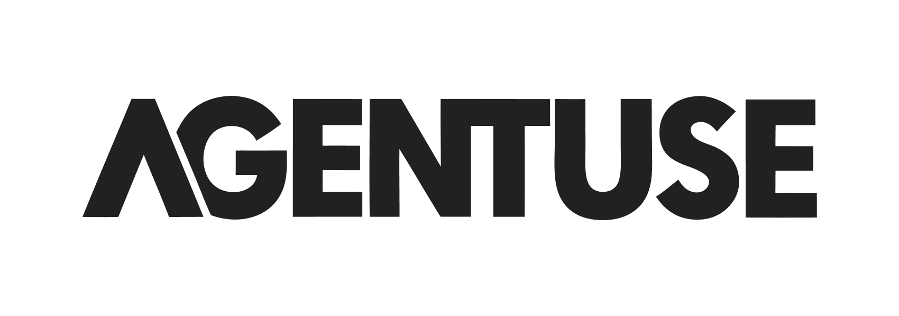
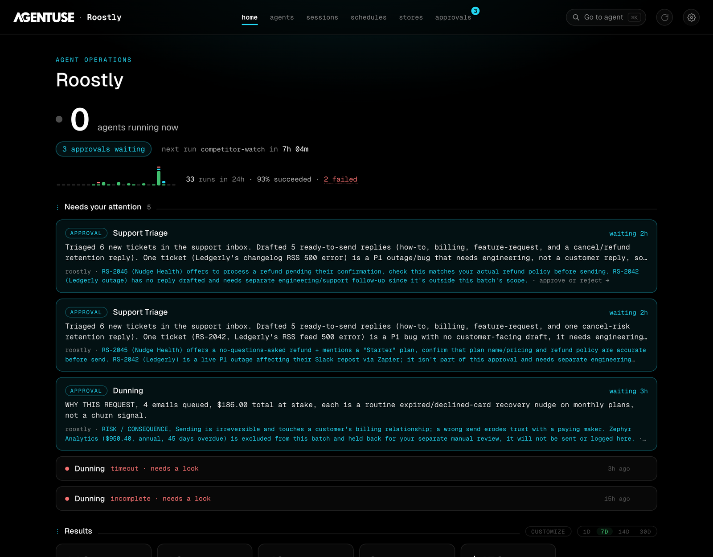
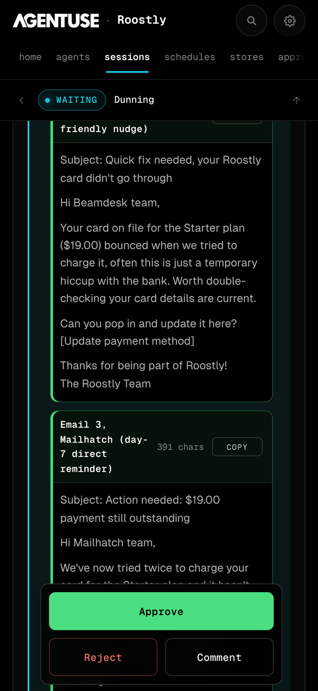

<picture>
  <source media="(prefers-color-scheme: dark)" srcset="./static/agentuse-logo-dark.png">
  <source media="(prefers-color-scheme: light)" srcset="./static/agentuse-logo.png">
  
</picture>

<p align="center"><strong>OPEN-SOURCE AGENT RUNTIME</strong></p>

<h1 align="center">Own the agents doing your company’s work.</h1>

<p align="center">
  Define agents in Markdown. Run them with Claude, OpenAI, or open models on infrastructure you control.<br>
  Let them work autonomously. Put consequential actions behind human approval.
</p>

<p align="center">
  <a href="https://www.npmjs.com/package/agentuse"></a>
  <a href="https://www.npmjs.com/package/agentuse"></a>
  <a href="https://github.com/agentuse/agentuse"></a>
  <a href="https://github.com/agentuse/agentuse/blob/main/LICENSE"></a>
</p>

<p align="center">
  <a href="#quick-start">Quick start</a> ·
  <a href="#define-the-agent-in-markdown">Define an agent</a> ·
  <a href="#operate-agents-not-prompts">Operations</a> ·
  <a href="https://docs.agentuse.io">Documentation</a>
</p>

AgentUse provides the agent loop, tools, durable sessions, schedules, approvals,
and operations dashboard. Your agents remain plain files in your repo: readable,
reviewable, versionable, and easy to take elsewhere.

Managed platforms own the runtime. Frameworks make you build it. AgentUse gives
you the runtime while keeping the agent under your control.

## Quick start

On macOS, download AgentUse from the
[latest GitHub release](https://github.com/agentuse/agentuse/releases/latest),
move it to Applications, and open it. The app includes the AgentUse runtime and
guides you through Desktop setup before joining the same sample and first-agent
flow as the Web UI. A separate Node.js or global CLI installation is not
required.

For Terminal, Linux, WSL, or a server, set up your first project without
installing AgentUse globally:

```bash
npx -y agentuse@latest setup
```

Choose Browser for guided visual setup or Terminal for a headless Linux/SSH
flow. Browser and Desktop can create a managed project under
`~/.agentuse/projects` or attach an existing project; Terminal creates and
registers the managed project.

Install the CLI globally if you want a persistent `agentuse` command in every
terminal, then connect a model provider before the first real run:

```bash
npm install -g agentuse
agentuse provider login
```

API keys also work through environment variables such as
`ANTHROPIC_API_KEY`, `OPENAI_API_KEY`, and `OPENROUTER_API_KEY`.

See the [macOS Desktop guide](https://docs.agentuse.io/guides/macos-desktop)
or the complete [Installation guide](https://docs.agentuse.io/installation).

## Define the agent in Markdown

An agent is a Markdown file with YAML configuration and plain-English
instructions. The filename is its default id.

```markdown
<!-- morning-repo-brief.agentuse -->
---
model: anthropic:claude-sonnet-5
description: Summarizes repository activity and flags work that needs attention
schedule: "0 8 * * 1-5"
tools:
  filesystem:
    - path: "${root}"
      permissions: [read]
  bash:
    commands:
      - "git status *"
      - "git log *"
      - "git show *"
      - "git diff *"
---

Create a concise repository brief for the last 24 hours.

1. Summarize meaningful changes.
2. Flag risky changes, failed work, and documentation drift.
3. Recommend the next actions in priority order.

Cite commit hashes and file paths for every finding.
If nothing meaningful changed, say so.
```

Run it directly:

```bash
agentuse run morning-repo-brief.agentuse
```

Start `agentuse serve` to activate its schedule:

```bash
agentuse serve -C .
```

The same file can run from a developer machine, a server, CI, or a container.
Configuration changes the trigger and environment, not the agent definition.

## Run it your way

| Trigger | How |
| --- | --- |
| [Command line](https://docs.agentuse.io/reference/cli-commands) | `agentuse run my-agent.agentuse` |
| [Schedule](https://docs.agentuse.io/guides/schedule) | Add `schedule` to frontmatter and keep `agentuse serve` running |
| [HTTP](https://docs.agentuse.io/guides/webhooks) | `POST /api/run` to an `agentuse serve` daemon |
| [CI/CD](https://docs.agentuse.io/guides/cicd) | Run the same CLI command inside your pipeline |
| [Docker](https://docs.agentuse.io/guides/self-hosting) | Mount or copy agent files into the AgentUse image |

Webhook example:

```bash
agentuse serve -C .

curl http://127.0.0.1:12233/api/run \
  -H "Content-Type: application/json" \
  -d '{"agent":"morning-repo-brief"}'
```

One daemon can serve several projects:

```bash
agentuse serve -C ./project-a -C ./project-b
```

`agentuse setup` is the recommended first-run entry point. Starting
`agentuse serve` without `-C` also opens the dashboard setup without adopting
your terminal's current directory. Existing folders stay opt-in via `-C` or
`serve.projects` in
`~/.agentuse/config.json`.

## Operate agents, not prompts

`agentuse serve` includes an operations dashboard at
`http://127.0.0.1:12233`. It keeps the outcome and operational state of every
run in one place:

- running agents and recent output
- sessions waiting for approval
- failed and incomplete work that needs review
- completed results and recorded metrics
- upcoming schedules, agent relationships, and project health

<p align="center">
  
</p>

Every run is a durable session. Inspect the result, tool calls, token usage,
artifacts, verification verdicts, and follow-up context without reconstructing
the run from terminal logs.

Test runs stay out of these operational views by default, so validating an agent
never pollutes the picture of what production is doing.

## Put consequential actions behind approval

Agents can prepare work autonomously and pause before sending, publishing,
deploying, deleting, or changing external state.

Add `approval: true` to give the agent a human review gate:

```markdown
---
model: anthropic:claude-sonnet-5
approval: true
---

Draft the customer announcement from the supplied release notes.

You may research, write, and revise the draft without approval.
Before sending or publishing it, ask for approval with the final text,
target audience, delivery channel, and any unresolved risks.
```

When the agent reaches that boundary, AgentUse suspends the session. A reviewer
can approve, reject, or comment from the session page, and the agent resumes
with that decision. Slack notifications are optional; AgentUse remains the
source of truth for the review and session state.

<p align="center">
  
</p>

See [Approval Gates](https://docs.agentuse.io/guides/approval-gates) for
complete configuration, reviewer flows, and enforcement details.

## Runtime primitives

| Primitive | What AgentUse provides |
| --- | --- |
| [Markdown agent files](https://docs.agentuse.io/guides/creating-agents) | Readable instructions and configuration that work with Git |
| [Model choice](https://docs.agentuse.io/guides/model-configuration) | Anthropic, OpenAI, OpenRouter, OpenCode Go, Amazon Bedrock, and compatible local endpoints |
| [Tools](https://docs.agentuse.io/reference/builtin-tools) | Allowlisted filesystem and shell access plus built-in runtime tools |
| [MCP](https://docs.agentuse.io/reference/agent-syntax#mcp-servers) | Connect databases, APIs, browsers, and external services through Model Context Protocol servers |
| [Skills](https://docs.agentuse.io/guides/skills) | Discover and load reusable `SKILL.md` instruction packages |
| [Sessions](https://docs.agentuse.io/guides/session-logs) | Persistent run history, usage, artifacts, resume, and failure visibility |
| [Subagents](https://docs.agentuse.io/guides/subagents) | Delegate bounded work to specialized child agents |
| [Stores](https://docs.agentuse.io/guides/store) | Persistent, structured state shared across runs and cooperating agents |
| [Learning](https://docs.agentuse.io/guides/learning) | Capture reviewer feedback as durable instructions and apply the best of them to later runs |
| [Verify](https://docs.agentuse.io/guides/verify) | Check a run's output against the agent's own success criteria before it counts as done |

List the currently recommended models:

```bash
agentuse models
```

Run with a different supported model without editing the file:

```bash
agentuse run my-agent.agentuse --model openai:gpt-5.6
agentuse run my-agent.agentuse --model ollama:<local-model>
```

Leaving the version off (`anthropic:claude-sonnet`) tracks the newest model in
that line. `models.aliases` in the AgentUse config gives your own `@fast`-style
names, `models.default` makes `model:` optional in agent files, and
`agentuse models unpin` converts existing files to the alias form.

Provider support means AgentUse can execute its own agent files with those model
APIs. It does not claim that `.agentuse` files deploy directly into each
provider's managed-agent platform.

## Author with AI coding assistants

Install the AgentUse skill for Claude Code, Codex, Cursor, Gemini CLI, GitHub
Copilot, Goose, OpenCode, Windsurf, and other assistants that support Agent
Skills:

```bash
npx skills add agentuse/agentuse
```

The installed discovery skill loads version-matched guidance from the CLI:

```bash
agentuse skills get core
agentuse skills get creator
agentuse skills get tester
```

Validate an agent's configuration before running it:

```bash
agentuse doctor my-agent.agentuse
```

Then validate its behaviour without touching anything real:

```bash
agentuse test my-agent.agentuse
```

Mock mode fabricates side effects, resolves approval gates automatically, and
isolates stores, so the agent runs end to end without changing external state.

## Documentation

- [Quick start](https://docs.agentuse.io/quickstart)
- [Creating agents](https://docs.agentuse.io/guides/creating-agents)
- [Agent syntax](https://docs.agentuse.io/reference/agent-syntax)
- [Model configuration](https://docs.agentuse.io/guides/model-configuration)
- [Operations dashboard](https://docs.agentuse.io/guides/serve-dashboard)
- [Approval gates](https://docs.agentuse.io/guides/approval-gates)
- [Self-hosting](https://docs.agentuse.io/guides/self-hosting)

## Commercial support

AgentUse is free and open source. If your team wants the runtime implemented,
customized, or operated in production,
[AgentUse Studio](https://agentuse.io/studio) offers hands-on setup, custom
agent development, and ongoing support.

## Contributing

- [Report bugs](https://github.com/agentuse/agentuse/issues)
- [Share ideas](https://github.com/agentuse/agentuse/discussions)
- [Development workflows](./DEVELOPMENT.md)

Local validation:

```bash
bun run test
bun run test:coverage
bun run test:e2e
bun run test:release
```

The dashboard smoke test creates a disposable project, daemon, browser session,
and XDG state directory. It never starts a scheduled agent or calls a model.

## License

[Apache 2.0](./LICENSE)
