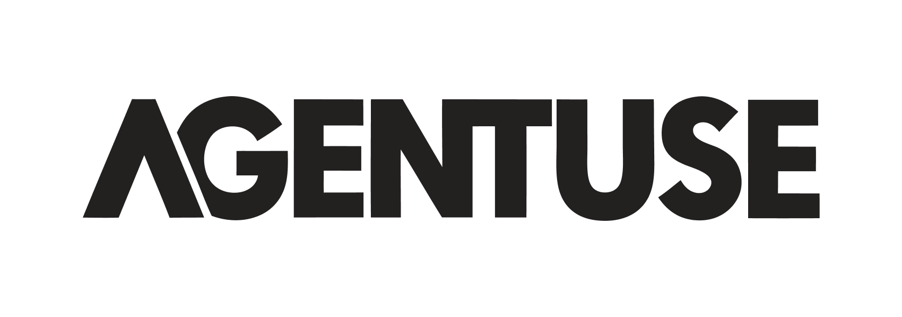

<picture>
  <source media="(prefers-color-scheme: dark)" srcset="./static/agentuse-logo-dark.png">
  <source media="(prefers-color-scheme: light)" srcset="./static/agentuse-logo.png">
  
</picture>

<h1 align="center">AI Agents on Autopilot</h1>

<p align="center">
  <a href="https://www.npmjs.com/package/agentuse"></a>
  <a href="https://www.npmjs.com/package/agentuse"></a>
  <a href="https://github.com/agentuse/agentuse"></a>
  <a href="https://github.com/agentuse/agentuse/blob/main/LICENSE"></a>
</p>

<p align="center">
  <strong>Define in markdown. Run on cron, CI/CD, or Docker.</strong><br/>
  No SDK. No flowcharts. Just AI agents that run themselves.
</p>

<p align="center">
  <a href="#quick-start">Quick Start</a> •
  <a href="#example">Example</a> •
  <a href="https://docs.agentuse.io">Documentation</a>
</p>

## Quick Start

```bash
# Try it now - no install needed
ANTHROPIC_API_KEY=sk-ant-... npx agentuse@latest run https://agentuse.io/hello.agentuse
```

Create `my-agent.agentuse`:

```markdown
---
model: anthropic:claude-sonnet-4-5
---

Generate a daily motivation quote with a tech fact.
Format as JSON with 'quote' and 'fact' fields.
```

Run it:

```bash
agentuse run my-agent.agentuse
```

## Example

A real-world agent with MCP tools:

```yaml
---
model: anthropic:claude-sonnet-4-5
mcpServers:
  postgres:
    command: npx
    args: ["-y", "@modelcontextprotocol/server-postgres"]
    requiredEnvVars: [DATABASE_URL]
---

Query the sales table for yesterday's metrics.
Generate an executive summary with trends.
```

Schedule with cron, run in CI/CD, or deploy to Docker.

## Features

### 📝 Markdown-Based Agents
Define agents as `.agentuse` files with YAML frontmatter and plain English instructions. Version control, code review, and collaborate on agents like any other code.

### 🔌 MCP Integration
Connect to any [Model Context Protocol](https://modelcontextprotocol.io) server. Access databases, APIs, file systems, and external services through a standardized tool interface.

### 🤖 Multi-Provider Support
Works with Anthropic (Claude), OpenAI (GPT), and OpenRouter for open source models like GLM and Minimax. Switch models with a single line change.

### 🎭 Sub-Agents
Compose complex workflows by delegating tasks to specialized child agents. Parent agents can spawn sub-agents with isolated contexts and step limits.

### ⚡ Skills System
Create reusable agent instructions as `SKILL.md` files. Reuse your existing Claude Code skills directly - AgentUse reads from the same `.claude/skills/` directories. List available skills with `agentuse skills`.

### 🌐 HTTP API
Run agents programmatically via REST endpoint. Supports JSON responses and NDJSON streaming for real-time output.

### 📊 Session Tracking
Full execution history with message logs, tool call traces, token usage, and timing metrics. Debug and audit agent runs with `agentuse sessions`.

## Install

```bash
npm install -g agentuse
```

Set your API key:

```bash
export ANTHROPIC_API_KEY="sk-ant-..."
# or
export OPENAI_API_KEY="sk-..."
# or
export OPENROUTER_API_KEY="sk-or-..."
```

## Documentation

Full guides and API reference at **[docs.agentuse.io](https://docs.agentuse.io)**

## Contributing

- [Report bugs](https://github.com/agentuse/agentuse/issues)
- [Share ideas](https://github.com/agentuse/agentuse/discussions)

## License

Apache 2.0
