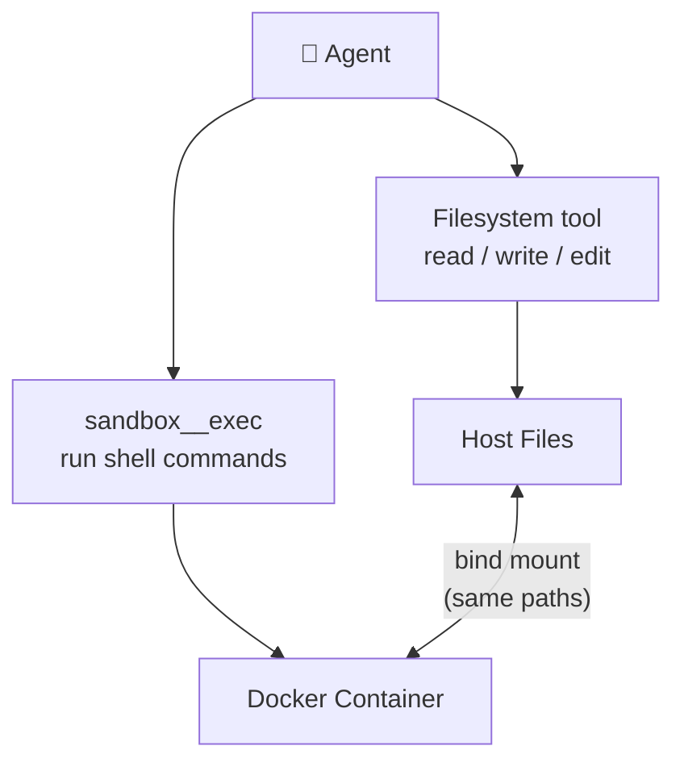

<Warning>
  The sandbox feature is experimental and may change in future versions.
</Warning>

The sandbox runs agent commands inside a Docker container while the **filesystem tool** handles all file I/O on the host. This separation means the agent can execute arbitrary shell commands safely without risking your host system, while file changes flow bidirectionally through bind mounts.

## Quick Start

Add `sandbox: true` and configure filesystem paths:

```yaml
---
model: anthropic:claude-sonnet-4-6
sandbox: true
tools:
  filesystem:
    - path: ${root}
      permissions: [read, write]
---

Analyze the project. Run tsc --noEmit to find type errors, then fix them.
```

**Docker** must be installed and running. The image is pulled automatically if needed.

## How Sandbox and Filesystem Work Together

The sandbox **only** provides command execution. All file access is controlled by the filesystem tool:



- **Filesystem tool** reads/writes files on the host — changes appear inside the container instantly via bind mount
- **`sandbox__exec`** runs commands inside the container — if the mount is read-write, file changes flow back to the host
- **Paths are identical** in host and container (no `/workspace/` alias)

### What Gets Mounted

Each filesystem path from your config is mounted at its **real host path** with the mode derived from its permissions:

```yaml
tools:
  filesystem:
    - path: ${root}
      permissions: [read]           # → mounted read-only
    - path: ${root}/src
      permissions: [read, write]    # → mounted read-write
    - path: ${tmpDir}
      permissions: [read, write]    # → mounted read-write (e.g. /tmp)
```

<Note>
  Glob patterns (e.g. `${root}/**/*.ts`) are skipped — only concrete directories can be mounted. If no filesystem tool is configured, the project root is mounted read-only.
</Note>

## Configuration

Use `sandbox: true` for defaults (Docker, `node:22-slim`), or provide a config object:

```yaml
sandbox: true                  # defaults

sandbox:                       # full config
  provider: docker
  image: python:3.12-slim     # default: node:22-slim
  timeout: 600                # seconds, default: 300
  setup:                      # run after container starts
    - pip install pandas numpy
```

| Field | Type | Default | Description |
|-------|------|---------|-------------|
| `provider` | `string` | — | Must be `docker` |
| `image` | `string` | `node:22-slim` | Docker image (auto-pulled if missing) |
| `timeout` | `number` | `300` | Max container lifetime in seconds |
| `setup` | `string \| string[]` | — | Commands to run before agent starts |
| `env` | `string[]` | — | Host env var names to forward into the container |

<Warning>
  If any setup command fails (non-zero exit), sandbox creation is aborted.
</Warning>

<Tip>
  **Common images:**
  - `node:22-slim` — Node.js / TypeScript (default)
  - `python:3.12-slim` — Python / data science
  - `ubuntu:24.04` — General purpose
  - `golang:1.23` / `rust:1.84-slim` — Go / Rust

  Need multiple runtimes? Use `setup` to install them (e.g. `apt-get install -y nodejs`).
</Tip>

### Environment Variables

The container starts with a **clean environment** — no host env vars are passed in, even if they are defined in your project's `.env` file. AgentUse loads `.env` into the host process, but the sandbox container does not inherit them.

To forward specific env vars into the container, use the `env` allowlist:

```yaml
sandbox:
  provider: docker
  env:
    - OPENAI_API_KEY      # from .env or shell environment
    - DATABASE_URL
```

Only declared vars that exist on the host are forwarded. Unset vars are silently skipped.

## Examples

### TypeScript Code Fix

```yaml
---
model: anthropic:claude-sonnet-4-6
sandbox: true
tools:
  filesystem:
    - path: ${root}
      permissions: [read, write, edit]
---

You are a code quality agent.
Run tsc --noEmit to find type errors, then fix them and verify.
```

### Python Data Processing

```yaml
---
model: openai:gpt-5-mini
sandbox:
  provider: docker
  image: python:3.12-slim
  setup: pip install pandas matplotlib
tools:
  filesystem:
    - path: ${root}
      permissions: [read, write]
store: true
---

You are a data analysis agent.
Run analysis scripts, save charts to the project, and store key metrics.
```

### Security Scanning (Read-Only)

```yaml
---
model: anthropic:claude-sonnet-4-6
sandbox:
  provider: docker
  setup: npm install -g snyk
tools:
  filesystem:
    - path: ${root}
      permissions: [read]
store: true
---

You are a security scanning agent.
Run snyk test, identify critical vulnerabilities, and store findings.
```

## Lifecycle

1. **Cleanup** — Remove any orphaned containers from previous runs (crash/force-quit safe)
2. **Pull** — Auto-pull the Docker image if not available locally
3. **Create** — Start container with filesystem paths bind-mounted at real host paths
4. **Setup** — Run `setup` commands sequentially inside the container
5. **Execute** — Agent uses `sandbox__exec` for commands, filesystem tool for file I/O
6. **Teardown** — Container is stopped and removed when the session ends, times out, or is aborted

<Card title="Self-Hosting" icon="docker" href="/guides/self-hosting">
  Need to run AgentUse itself inside Docker? See the self-hosting guide.
</Card>
